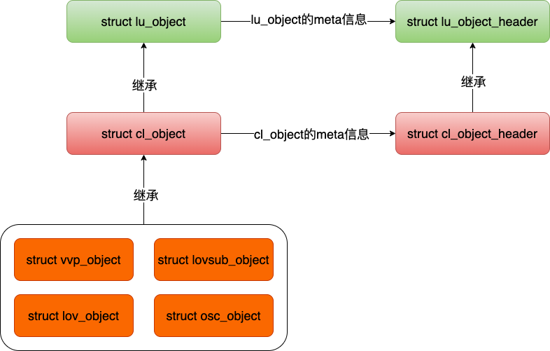
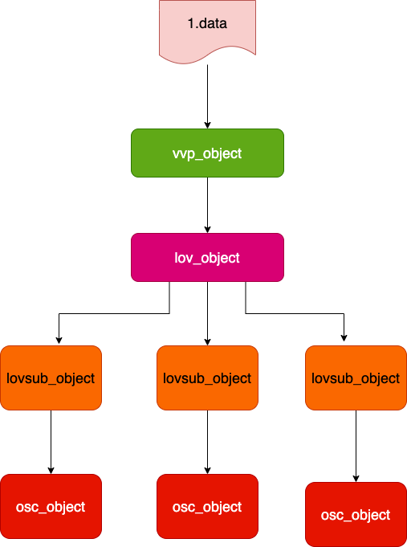

### 前言

- 文件或者文件stripe在lustre中都统称为`object`.客户端`stack`和MDT的`stack`复用一些对象，比如`struct lu_object`用来表示文件对象。`struct lu_object->>lo_linkage`链接到`struct lu_object_header->loh_layers`来表示全栈的对象.
	
 - `struct  lu_object`和`struct lu_object_header`在客户端和服务端提供 3个核心的功能；它们分别是a)每个文件对象采用`fid`作为唯一标识，所有对象都存储在以fid为索引的哈希表中；b)每个对象都会被引用计数，当对象release后就会被放到`cache`中，显示的标记删除对象立即被销毁；3)`cache`中的对象采用`LRU`算法来管理。
 - 在客户端`struct lu_object`被`cl_object`继承作为客户端对象的基类，对于`struct cl_object`又被`vvp_object、lov_object、lovsub_object、osc_object`继承；在MDT端`struct lu_object`被`struct md_object`继承。



```c
// 每一层的lu_object
struct lu_object {
	    // 对象header
        struct lu_object_header           *lo_header;
        // 当前的device
        struct lu_device                  *lo_dev;
       // lu_object对象的操作函数表
        const struct lu_object_operations *lo_ops;
         // all layers的链接
		struct list_head		   lo_linkage;
		struct lu_ref_link                 lo_dev_ref;
};

// lu_object的header对象
struct lu_object_header {
	// 每个对象的唯一标识
	struct lu_fid		loh_fid;
	// 对象的flag
	unsigned long		loh_flags;
	// 对象的引用计数
	atomic_t		loh_ref;
	// 对象通用属性
	__u32			loh_attr;
	// 连接到哈希表的字段
	struct rhash_head	loh_hash;
	// lru维护列表
	struct list_head	loh_lru;

	// 链接到layers的链表中 
	struct list_head	loh_layers;
	
	struct lu_ref		loh_reference;
	struct rcu_head		loh_rcu;
};

struct cl_object {
        // super父类对象
        struct lu_object                   co_lu;
        // 本层的cl_object操作函数表
        const struct cl_object_operations *co_ops;
		int				   co_slice_off;
};

// cl_object的扩展header
struct cl_object_header {
        // 内嵌lu_object_header
	   struct lu_object_header	coh_lu;

        // 父对象
        struct cl_object_header *coh_parent;
      
         // 在父对象和子对象之间的属性维护的锁
		spinlock_t		 coh_attr_guard;

		 // cl_page和操作cl_page函数表大小
		unsigned short		 coh_page_bufsize;
	
		 // 是否是top-object的表示，0表示是；1表示sub-objects
		unsigned char		 coh_nesting;
};


```

### 客户端中定义的`Object`


- `vvp_object`负责`vfs、vm、posix`三个层面的事情，这个对象包含了`Linux kernel`的`inode`
```c
struct vvp_object {
	// 客户端对象的header用来链接下一层的处理object的device
	struct cl_object_header vob_header;
	//当前vvp_object的对应的客户端对象
	struct cl_object        vob_cl;
	// 文件对应的inode
	struct inode           *vob_inode;

	 // 用于统计mmap的文件的计数
	atomic_t                vob_mmap_cnt;

	unsigned int		vob_discard_page_warned:1;
};


```

- `lov_object`用来描述每个文件或者文件对象的布局信息

```c
struct lov_object {
  // 文件布局信息的队形
	struct cl_object	lo_cl;
	/**
	 * Serializes object operations with transitions between layout types.
	 *
	 * This semaphore is taken in shared mode by all object methods, and
	 * is taken in exclusive mode when object type is changed.
	 *
	 * \see lov_object::lo_type
	 */
	 
	struct rw_semaphore	lo_type_guard;
	/**
	 * Type of an object. Protected by lov_object::lo_type_guard.
	 */
	enum lov_layout_type	lo_type;
	/**
	 * Object flags.
	 */
	unsigned long		lo_obj_flags;
	/**
	 * How many IOs are on going on this object. Layout can be changed
	 * only if there is no active IO.
	 */
	atomic_t	       lo_active_ios;
	/**
	 * Waitq - wait for no one else is using lo_lsm
	 */
	wait_queue_head_t	lo_waitq;

	// 文件对象的布局信息
	struct lov_stripe_md  *lo_lsm;

	union lov_layout_state {
		struct lov_layout_state_empty {
		} empty;
		struct lov_layout_state_released {
		} released;
		struct lov_layout_composite {
			/**
			 * flags of lov_comp_md_v1::lcm_flags. Mainly used
			 * by FLR.
			 */
			uint32_t        lo_flags;
	
			 // FLR功能需要维护的对象
			int             lo_preferred_mirror;

			unsigned        lo_mirror_count;
			struct lov_mirror_entry *lo_mirrors;
		
			unsigned int    lo_entry_count;
			struct lov_layout_entry *lo_entries;
		} composite;
	} u;
	/**
	 * Thread that acquired lov_object::lo_type_guard in an exclusive
	 * mode.
	 */
	struct task_struct            *lo_owner;
};
```

- `lovsub_object`负责维护每个文件分片的信息对象
```c
struct lovsub_object {
	  // 当前lovsub_object的header
        struct cl_object_header lso_header;
        // 当前lovsub_object的对象
        struct cl_object        lso_cl;
        // lovsub_object对应的父对象
        struct lov_object      *lso_super;
        // 子对象对应的索引
        int                     lso_index;
};
```

- `osc_object`是连接到后端ost的维护的对象,这个与`lovsub_object`一一对应
```c
// ost客户端维护的对象
struct osc_object {
	struct cl_object	oo_cl;
	struct lov_oinfo	*oo_oinfo;
	/**
	 * True if locking against this stripe got -EUSERS.
	 */
	int			oo_contended;
	ktime_t			oo_contention_time;
#ifdef CONFIG_LUSTRE_DEBUG_EXPENSIVE_CHECK
	/**
	 * IO context used for invariant checks in osc_lock_has_pages().
	 */
	struct cl_io		oo_debug_io;
	/** Serialization object for osc_object::oo_debug_io. */
	struct mutex		oo_debug_mutex;
#endif
	/**
	 * used by the osc to keep track of what objects to build into rpcs.
	 * Protected by client_obd->cli_loi_list_lock.
	 */
	struct list_head	oo_ready_item;
	struct list_head	oo_hp_ready_item;
	struct list_head	oo_write_item;
	struct list_head	oo_read_item;

	/**
	 * extent is a red black tree to manage (async) dirty pages.
	 */
	struct rb_root		oo_root;
	/**
	 * Manage write(dirty) extents.
	 */
	struct list_head	oo_hp_exts;	/* list of hp extents */
	struct list_head	oo_urgent_exts;	/* list of writeback extents */
	struct list_head	oo_full_exts;

	struct list_head	oo_reading_exts;

	atomic_t		oo_nr_reads;
	atomic_t		oo_nr_writes;

	/** Protect extent tree. Will be used to protect
	 * oo_{read|write}_pages soon. */
	spinlock_t		oo_lock;

	/**
	 * Radix tree for caching pages
	 */
	spinlock_t		oo_tree_lock;
	struct radix_tree_root	oo_tree;
	unsigned long		oo_npages;

	/* Protect osc_lock this osc_object has */
	struct list_head	oo_ol_list;
	spinlock_t		oo_ol_spin;

	/** number of active IOs of this object */
	atomic_t		oo_nr_ios;
	wait_queue_head_t	oo_io_waitq;

	const struct osc_object_operations *oo_obj_ops;
	bool			oo_initialized;
};

```

### 客户端中定义的`Object`的操作函数
```c

/************vvp object操作函数************/
static const struct lu_device_operations vvp_lu_ops = {
        .ldo_object_alloc      = vvp_object_alloc
};

static const struct lu_object_operations vvp_lu_obj_ops = {
	.loo_object_init	= vvp_object_init,
	.loo_object_free	= vvp_object_free,
	.loo_object_print	= vvp_object_print,
};

/************lov object操作函数************/
static const struct lu_device_operations lov_lu_ops = {
	.ldo_object_alloc      = lov_object_alloc,
	.ldo_process_config    = lov_process_config,
};

static const struct lu_object_operations lov_lu_obj_ops = {
	.loo_object_init	= lov_object_init,
	.loo_object_delete	= lov_object_delete,
	.loo_object_release	= NULL,
	.loo_object_free	= lov_object_free,
	.loo_object_print	= lov_object_print,
	.loo_object_invariant	= NULL,
};

/************lovsub object操作函数************/

static const struct lu_device_operations lovsub_lu_ops = {
	.ldo_object_alloc      = lovsub_object_alloc,
	.ldo_process_config    = NULL,
	.ldo_recovery_complete = NULL
};


static const struct lu_object_operations lovsub_lu_obj_ops = {
	.loo_object_init      = lovsub_object_init,
	.loo_object_delete    = NULL,
	.loo_object_release   = NULL,
	.loo_object_free      = lovsub_object_free,
	.loo_object_print     = lovsub_object_print,
	.loo_object_invariant = NULL
};


/************osc object操作函数************/

static const struct lu_device_operations osc_lu_ops = {
        .ldo_object_alloc      = osc_object_alloc,
		.ldo_process_config    = osc_process_config,
        .ldo_recovery_complete = NULL
};

static const struct lu_object_operations osc_lu_obj_ops = {
	.loo_object_init      = osc_object_init,
	.loo_object_release   = NULL,
	.loo_object_free      = osc_object_free,
	.loo_object_print     = osc_object_print,
	.loo_object_invariant = NULL
};

```


### 从`inode create`视角来看`object`过程
- `ll_atomic_open`提供文件`create&open`的函数，文件创建请求从用户发出,到了linux kernel中的vfs，最终进入vfs中已经被lustre文件系统赋值`ll_dir_inode_operations`中，发现是文件创建请求就直接走`atomic_open`指向的`ll_atomic_open`
```c
const struct inode_operations ll_dir_inode_operations = {
	.atomic_open	= ll_atomic_open,
};
```

- 下面我们从`ll_atomic_open`开始来观测`object`创建的链路，整个链路中`lu_device_operations`是用来申请和配置`client stack`中对象；`lu_object_operations`用来初始化和处理函数。客户端的`device`部分是客户端加载时候load的；一部分是通过和MGS通信拿到llog然后解析llog加载到客户端，从而形成了整个`client device stack`.


```c

// raid0模式下文件对象stripe处理函数
static struct lov_comp_layout_entry_ops raid0_ops = {
	.lco_init      = lov_init_raid0,
	.lco_fini      = lov_fini_raid0,
	.lco_getattr   = lov_attr_get_raid0,
};

// dom模式下文件对象stripe处理函数
static struct lov_comp_layout_entry_ops dom_ops = {
	.lco_init = lov_init_dom,
	.lco_fini = lov_fini_dom,
	.lco_getattr = lov_attr_get_dom,
};

//  如下是从inode create的角度分析客户端client的object,这里忽略了rpc和部分处理细节
 void ll_atomic_open() {
	ll_lookup_it(){
		ll_lookup_it_finish(){
			ll_prep_inode() {
				ll_iget() {
					// 设置inode的数据和元数据的处理函数
					ll_read_inode2()
					// 初始化客户端文件的inode
					cl_file_inode_init(){
						// 客户端对象的初始化函数入口
						cl_object_find(){
							// lu_object查找和初始化
							lu_object_find_at(){
								// 哈希表中查找
								htable_lookup()
								// lu_object的申请
								lu_object_alloc()
								// 初始化lu_object对象的vvp和lov对象
								lu_object_start() {
									// vvp_object的初始化
									vvp_object_init()
									// lov_object初始化
									lov_object_init()
									{
										//  这里指向的是lov_init_raid0函数
										// ops = &lov_dispatch[lov->lo_type];
										// rc = ops->llo_init(env, dev, lov, lsm, cconf, set);
										lov_init_composite(){
											for (i = 0, j = 0, mirror_count = 1; i < entry_count; i++) {
												lle = &comp->lo_entries[i];
												switch (lle->lle_type) {
													case LOV_PATTERN_RAID0:
														lle->lle_comp_ops = &raid0_ops;
														break;
													case LOV_PATTERN_MDT:
														lle->lle_comp_ops = &dom_ops;
														break;
											}
											// 处理lov对象的，stripe成lovub_object对象、初始化osc_object
											lov_foreach_layout_entry(lov, lle) {
												// 这里实际调用的是lov_init_raid0
												// lle->lle_comp_ops->lco_init();
												// 一个函数初始化lovsub_object和osc_object对象
												lov_init_raid0()
												{
													for (i = 0; i < r0->lo_nr; ++i) {
														lov_sub_find(){
															// cache中查找
															htable_lookup()
															// lu_object申请
															lu_object_alloc()
															lu_object_start()
															{
																// do{ }whie()循环中初始化其他的object
																lovsub_object_init()
																osc_object_init()
															}
														}
													}
												}
											}
										}
									}
								}
							}
						}
					}
				}
			}
		}
	}

}
```