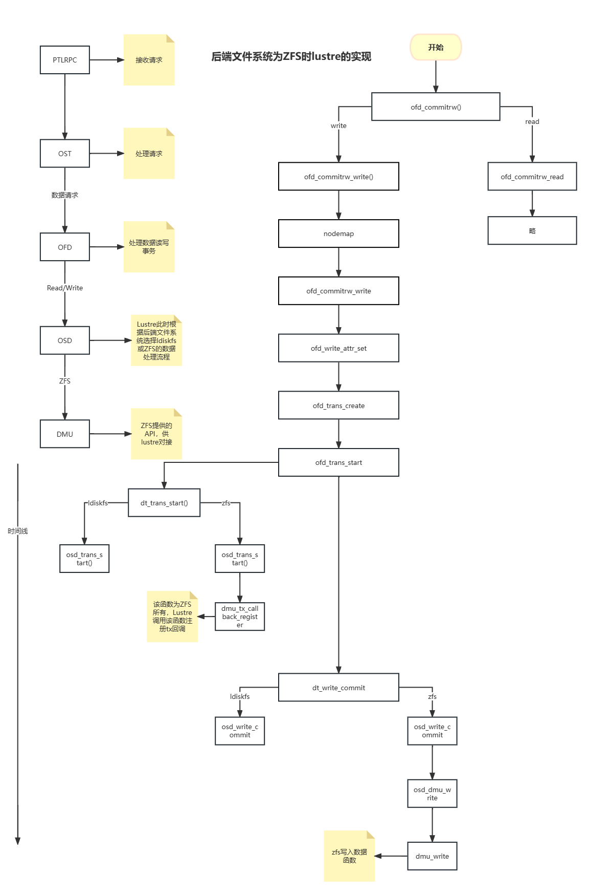

# 内核相关写日志分析2.0

## 1. 测试环境

| key | value | 补充说明 |
| --- | --- | --- |
| lustre version | 2.15.0 |  |
| fsname | debugfs |  |
| mds ip | 192.168.242.21 | mds充当mgs且仅有一个mdt |
| oss ip | 192.168.242.22 | oss仅有一个ost |
| client ip | 192.168.242.10 | 挂载点为/mnt/client |
| client ip | 192.168.242.12 | 挂载点为/mnt/client |

## 2. 写日志分析

### 2.1. 操作步骤

1. 在oss上执行 `lctl set_param debug=+info`使用info级别日志
2. 在oss上执行 `lctl set_param debug=+inode` 添加inode调试信息
3. 在oss上执行`lctl debug_kernel /tmp/log`清空日志
4. 在客户端中使用 `dd if=/dev/zero of=testfile bs=1c count=16384` 命令生成大小为16384字节的文件
5. 在客户端中使用`cp testfile /mnt/client/test`命令写入数据
6. 等待30秒：目前发现执行数据写入操作后，日志中并不会立刻更新相关的写日志，故应等待30秒后再获取日志
7. 在oss上执行`lctl debug_kernel /tmp/log`获取ost写日志

### 2.2. ost写日志及分析

```bash
00000100:00000040:0.0:1685849327.304471:0:3551:0:(events.c:358:request_in_callback()) incoming req@0000000056d1689f x1766202292267968 msgsize 16872
00000020:00000040:0.0:1685849327.304505:0:3814:0:(genops.c:911:class_conn2export()) looking for export cookie 0xaefde85a03e12aa7
00000020:00000040:0.0:1685849327.304511:0:3814:0:(lustre_handles.c:151:class_handle2object()) GET export 00000000d6afaa13 refcount=9
00000100:00000040:0.0:1685849327.304524:0:3814:0:(service.c:1263:ptlrpc_at_set_timer()) armed ost_io at +1s
# ost_io为io读写请求
00000020:00000040:0.0:1685849327.304534:0:3814:0:(lustre_handles.c:151:class_handle2object()) GET ldlm 000000006b06ab32 refcount=3
00000100:00000040:0.0:1685849327.304547:0:3814:0:(service.c:2031:ptlrpc_server_request_get()) RPC GETting export 00000000d6afaa13 : new rpc_count 1
00000100:00000040:0.0:1685849327.304550:0:3814:0:(lustre_net.h:2402:ptlrpc_rqphase_move()) @@@ move request phase from New to Interpret  req@0000000056d1689f x1766202292267968/t0(0) o4->c533e830-451b-4996-a72c-008e7736bf8b@192.168.242.10@tcp:18/0 lens 16872/0 e 0 to 0 dl 1685849333 ref 1 fl New:/0/ffffffff rc 0/-1 job:''
00000020:00000040:0.0:1685849327.304666:0:3814:0:(tgt_handler.c:2771:tgt_brw_write()) Client use short io for data transfer, size = 16384
# 采用short io模式进行传输，即将数据信息放入ptlrpc信息中
# short io 阈值为16384
# 如果数据大小大于16384，则将数据信息（数据长度，偏移值等信息）写入块描述符中，再由ptlrpc后续进行传输实际数据
00000001:00000040:0.0:1685849327.304712:0:3814:0:(linux-crypto.c:130:cfs_crypto_hash_alloc()) Using crypto hash: adler32 (adler32-zlib) speed 2907 MB/s
# 初始化带有crypto哈希算法的状态描述符，且使用adler32的校验和算法
# 校验和算法用于保障数据的正确性
# 例如对于数据1101001，客户端通过算法算出校验和为1010，将校验和加在数据后，则整个数据为11010011010，服务端使用相同的算法再次计算得出校验和进行比较即可判断数据是否正确
00080000:00000002:0.0:1685849327.304761:0:3814:0:(osd_xattr.c:924:osd_xattr_set()) Setting xattr trusted.fid with size 52
00080000:00000002:0.0:1685849327.304822:0:3814:0:(osd_io.c:890:osd_write_commit()) write 4096 bytes at 0
00080000:00000002:0.0:1685849327.304869:0:3814:0:(osd_io.c:890:osd_write_commit()) write 4096 bytes at 4096
00080000:00000002:0.0:1685849327.304872:0:3814:0:(osd_io.c:890:osd_write_commit()) write 4096 bytes at 8192
00080000:00000002:0.0:1685849327.304874:0:3814:0:(osd_io.c:890:osd_write_commit()) write 4096 bytes at 12288
# 写入流程的关键，在此处进行数据的实际写入
# 每个页大小为4k，所以将数据以4k为单位切割为若干块，传入后端文件系统
# 如果数据不足4k，假设数据大小16385，最后一段数据则会显示write 1 bytes at 16384
# 当前测试中后端文件系统为ZFS，ZFS会接收数据至缓存中，以事务组的形式写入硬盘，即最终写入硬盘并非以4k为单位写入
00000020:00000040:0.0:1685849327.304880:0:3814:0:(tgt_grant.c:1560:tgt_grant_commit_cb_add()) callback GETting export 00000000d6afaa13 : new cb_count 1
00000020:00000040:0.0:1685849327.304882:0:3814:0:(genops.c:968:class_export_get()) GET export 00000000d6afaa13 refcount=10
00080000:00000002:0.0:1685849327.304883:0:3814:0:(osd_xattr.c:924:osd_xattr_set()) Setting xattr trusted.version with size 8
# 扩展属性trusted.version大小为8，用于存储访问文件或目录的版本号
00000001:00000002:0.0:1685849327.304913:0:3814:0:(tgt_lastrcvd.c:1424:tgt_last_rcvd_update()) transno = 30064771131, last_committed = 30064771130
00000001:00000040:0.0:1685849327.304915:0:3814:0:(tgt_lastrcvd.c:947:tgt_last_commit_cb_add()) callback GETting export 00000000d6afaa13 : new cb_count 2
00000020:00000040:0.0:1685849327.304915:0:3814:0:(genops.c:968:class_export_get()) GET export 00000000d6afaa13 refcount=11
00000020:00000002:0.0:1685849327.304924:0:3814:0:(lu_object.c:224:lu_object_put()) Add 00000000e9d1d299/0000000043af6513 to site lru. bkt: 000000002bf18836
# lu_object_put实现减少对象引用计数功能
# 结构体lu_object描述当前文件对象，指针地址为00000000e9d1d299，结构体内包含成员lu_object_header存储fid等信息，指针地址为0000000043af6513
# lru：最近最久未使用LRU(Least Recently Used)置换算法，提高对数据的命中率以提升性能
# bkt对应结构体lu_site_bkt_data，其成员lsb_lru存储lru列表
00010000:00000040:0.0:1685849327.304930:0:3814:0:(ldlm_lib.c:3178:target_committed_to_req()) last_committed 0, transno 30064771131, xid 1766202292267968
00000100:00000040:0.0:1685849327.304933:0:3814:0:(connection.c:145:ptlrpc_connection_addref()) conn=000000006f7fb23f refcount 3 to 192.168.242.10@tcp
00000100:00000040:0.0:1685849327.304935:0:3814:0:(niobuf.c:58:ptl_send_buf()) peer_id 12345-192.168.242.10@tcp
00000100:00000040:0.0:1685849327.304945:0:3814:0:(lustre_net.h:1943:ptlrpc_connection_put()) PUT conn=000000006f7fb23f refcount 2 to 192.168.242.10@tcp
00000100:00000040:0.0:1685849327.304947:0:3814:0:(lustre_net.h:2402:ptlrpc_rqphase_move()) @@@ move request phase from Interpret to Complete  req@0000000056d1689f x1766202292267968/t30064771131(0) o4->c533e830-451b-4996-a72c-008e7736bf8b@192.168.242.10@tcp:18/0 lens 16872/448 e 0 to 0 dl 1685849333 ref 1 fl Interpret:/0/0 rc 0/0 job:''
00000100:00000040:0.0:1685849327.304950:0:3814:0:(service.c:1102:ptlrpc_server_finish_active_request()) RPC PUTting export 00000000d6afaa13 : new rpc_count 0
00000020:00000040:0.0:1685849327.304951:0:3814:0:(lustre_handles.c:151:class_handle2object()) GET ldlm 000000006b06ab32 refcount=3
00000020:00000040:0.0:1685849327.304954:0:3814:0:(genops.c:979:class_export_put()) PUTting export 00000000d6afaa13 : new refcount 10
```

### 2.3.ost写流程总结

1. ptlrpc收到请求0000000056d1689f，事务xid为1766202292267968，信息长度为16872字节（测试写入数据大小为16384B，符合short io模式要求，数据合并到ptlrpc信息中进行传输，实际上写请求花费了16872-16384=488字节）
2. obdclass从哈希表中查找export cookie（哈希值）0xaefde85a03e12aa7，获得export 00000000d6afaa13
3. ptlrpc为最近的ost_io操作设置截止时间1秒，ost_io操作为ost模块所有
4. obdclass引用ldlm 000000006b06ab32
5. ptlrpc从未执行队列中取得事务xid 1766202292267968，并将其状态设置为New
6. ofd开始执行写数据流程，当前使用short io模式，调用osd
7. osd选择zfs数据执行分支，调用zfs提供的api DMU
8. zfs写入数据
9. obdclass更新lru
10. ptlrpc模块将事务xid 1766202292267968状态设置为Complete
11. ptlrpc释放请求，减少export的引用计数

### 2.4 涉及内核模块

ptlrpc：Portal Transport Layer RPC. 它构建于LNET之上，提供客户端和服务器之间进行消息通信的接口。

obdclass：Provides an abstraction layer that allows generic operations to be applied on Lustre components without having the knowledge of specific components. MGC, MDC, OSC, LOV, LMV are examples of obd devices in Lustre that make use of the obdclass generic abstraction layer.

ldlm：Lustre Distributed Lock Manager

ost：Object Storage Target

ofd：Object Filter Device

osd：Object Storage Device ，对接后端文件系统ldiskfs和zfs

### 2.5. 写操作流程图


